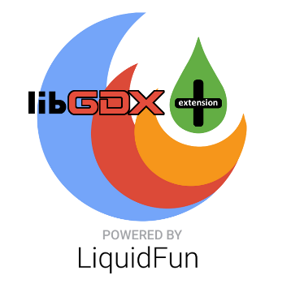

gdx-liquidfun-extension
=======================

An extension to implement liquidfun into libgdx.
Read the wiki to learn how to use this extension in your project.

You can also get some information or ask some questions [in the badlogic forum][].

  [in the badlogic forum]: http://www.badlogicgames.com/forum/viewtopic.php?f=17&t=13717

Update by Thommil
=======================
* Import/merge of trunk version of LibGDX Box2D (22/01/2016)
* Build fix for IOS
* Bugs fix

<target name="gdx-liquidfun" depends="gdx-core">
	<path id="classpath">
		<pathelement location="${distDir}/gdx.jar"/>
		<pathelement location="${distDir}/extensions/gdx-jnigen/gdx-jnigen.jar"/>
	</path>
	<ant antfile="../../../build-template.xml" dir="extensions/gdx-liquidfun/gdx-liquidfun">
		<property name="distDir" value="${distDir}/extensions/gdx-liquidfun/"/>
		<property name="jar" value="gdx-liquidfun"/>
		<reference refid="classpath"/>
	</ant>
</target>
